<div align="center">


# project-showcase-next

**全栈作品集 + CMS 后台。** 终端 / 工程美学,端到端类型安全,Next.js 16 RSC + 流式 AI。

<sub>// Live · <a href="https://project.zxbdwy.online">project.zxbdwy.online</a></sub>

<br />


</div>

---

## 截图

<table>
  <tr>
    <td width="50%" align="center">
      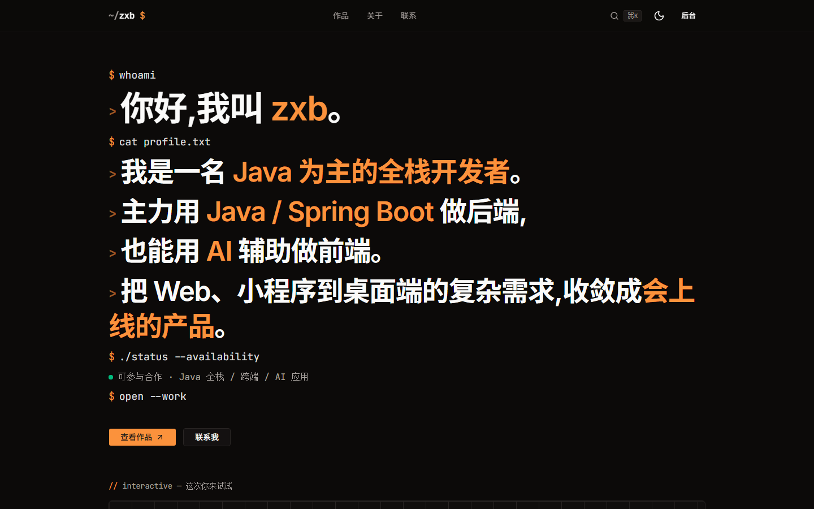
      <sub><b>首页 · Hero</b> — 终端窗口 + 能力数据条 + 实时拼装命令</sub>
    </td>
    <td width="50%" align="center">
      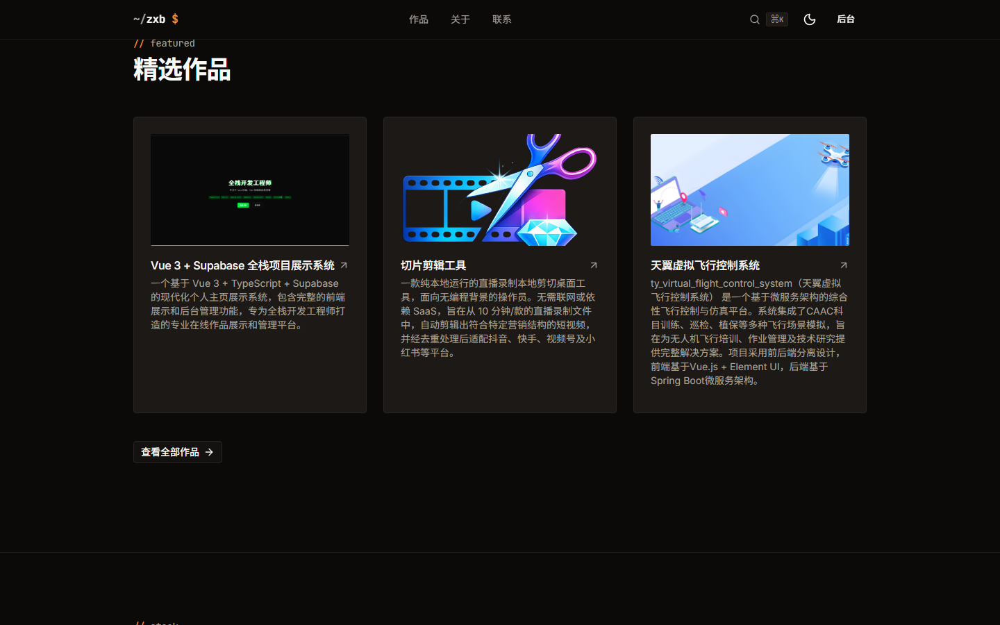
      <sub><b>首页 · 精选作品</b> — 文件式编号卡片网格</sub>
    </td>
  </tr>
  <tr>
    <td width="50%" align="center">
      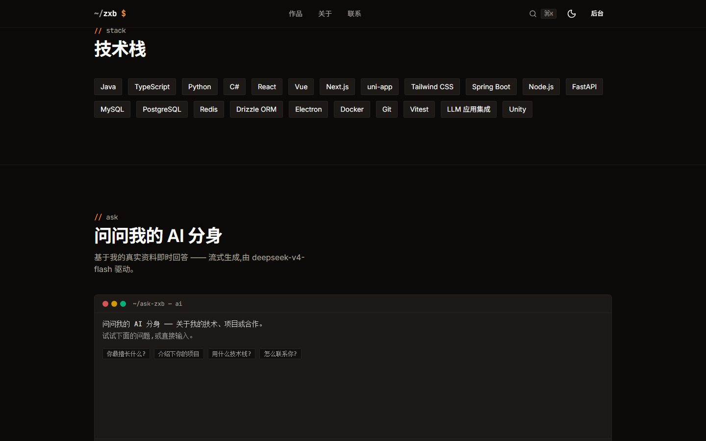
      <sub><b>首页 · 技术栈</b> — 等宽 chip 矩阵 · 分组排布</sub>
    </td>
    <td width="50%" align="center">
      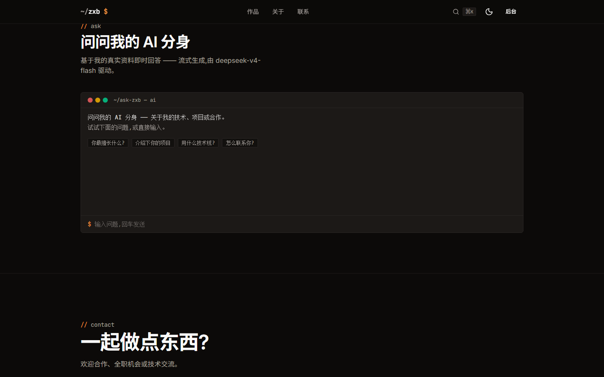
      <sub><b>首页 · AI 分身</b> — 流式 + 多步工具调用聊天入口</sub>
    </td>
  </tr>
  <tr>
    <td width="50%" align="center">
      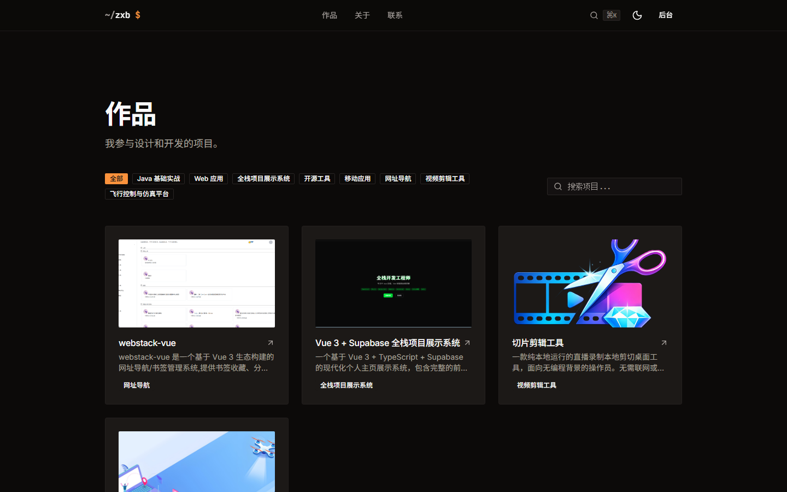
      <sub><b>作品列表</b> — 分类筛选 + 关键字搜索 + 视图模式</sub>
    </td>
    <td width="50%" align="center">
      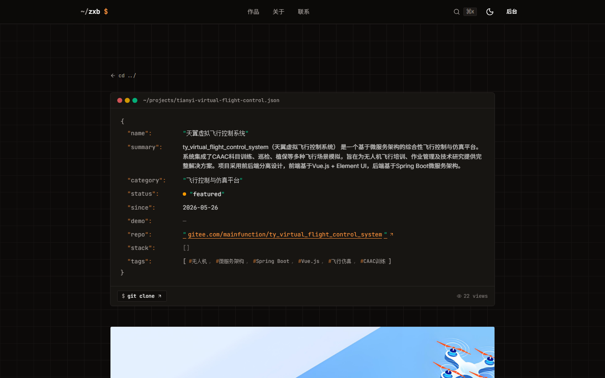
      <sub><b>项目详情 · Hero</b> — JSON manifest 终端窗口</sub>
    </td>
  </tr>
  <tr>
    <td width="50%" align="center">
      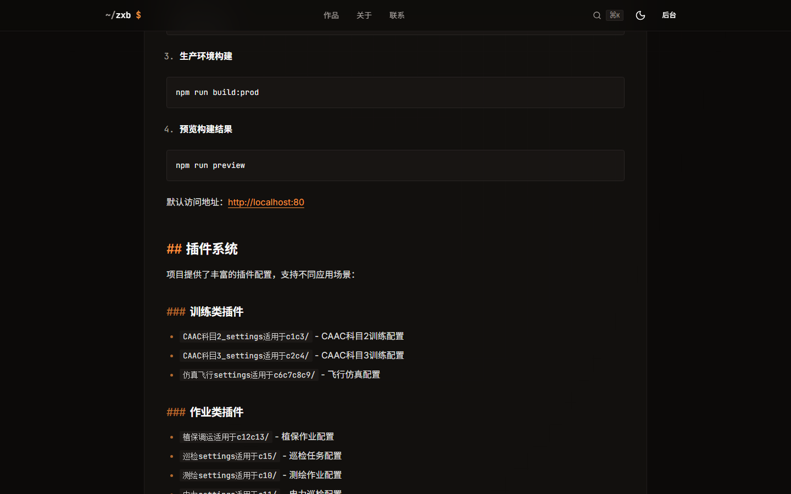
      <sub><b>项目详情 · README</b> — MDX 渲染 + 幻灯片预览</sub>
    </td>
    <td width="50%" align="center">
      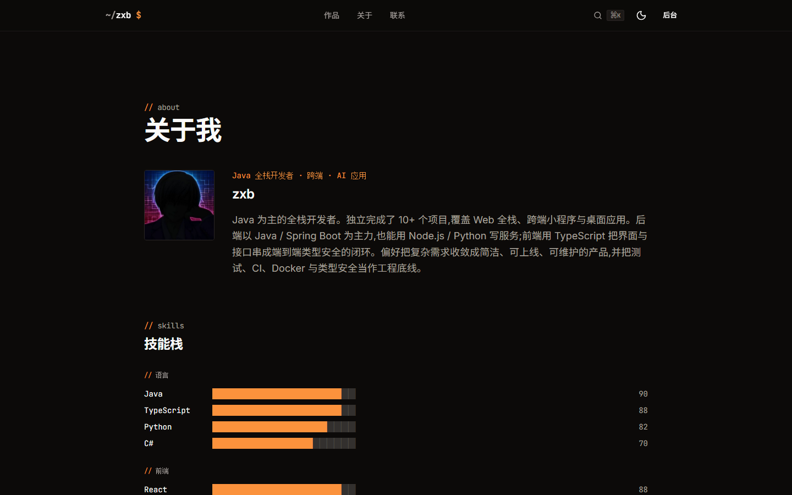
      <sub><b>关于 · Hero</b> — 个人介绍 + 社交链接</sub>
    </td>
  </tr>
  <tr>
    <td width="50%" align="center">
      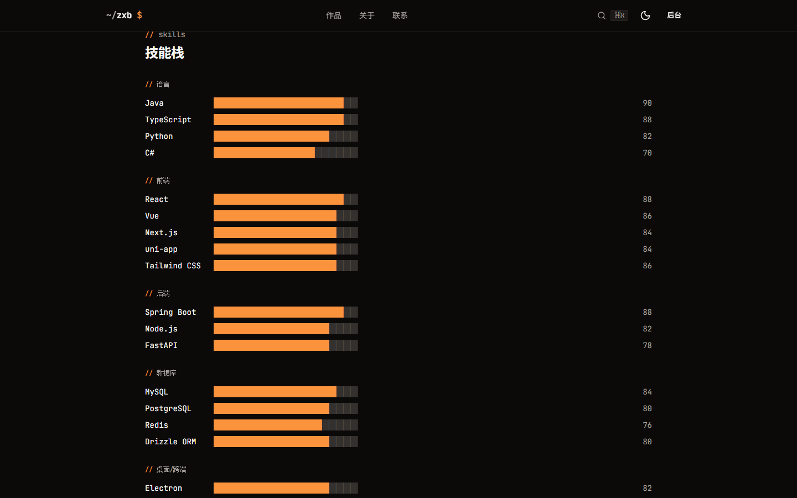
      <sub><b>关于 · 技能</b> — 分组技能矩阵</sub>
    </td>
    <td width="50%" align="center">
      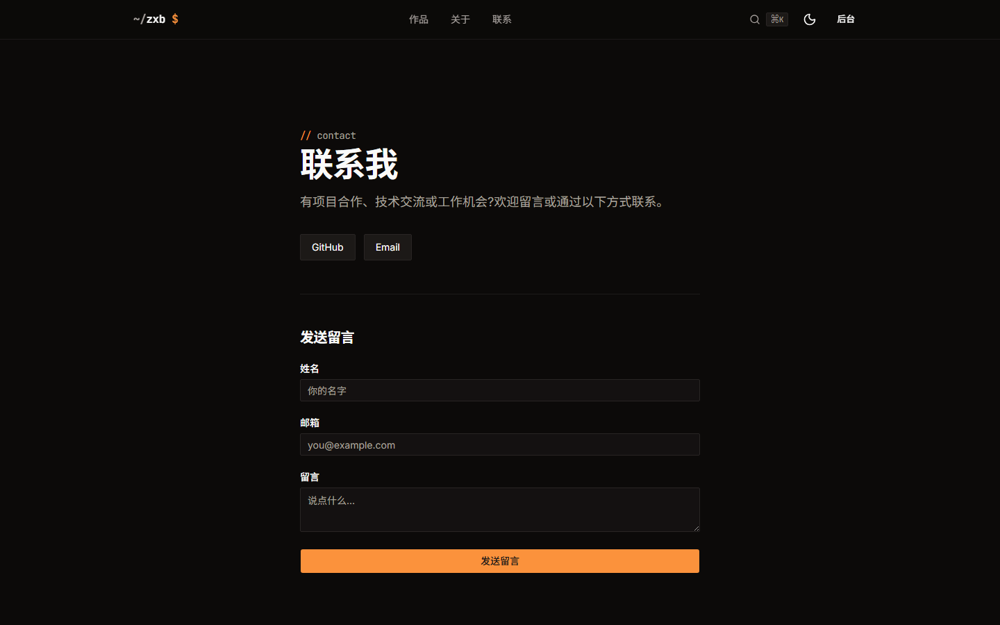
      <sub><b>联系</b> — Server Action 表单 · 缺 SMTP 降级日志</sub>
    </td>
  </tr>
  <tr>
    <td colspan="2" align="center">
      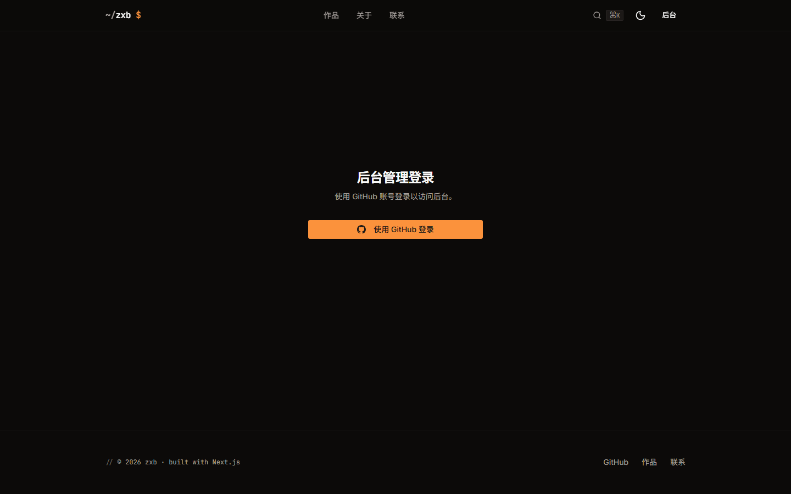
      <sub><b>后台</b> — GitHub OAuth · <code>/admin</code> 中间件保护 · 演示只读模式</sub>
    </td>
  </tr>
</table>

## 特性

- **终端 / 工程美学** — 暖橙琥珀 + 暖灰 stone + JetBrains Mono;方角、克制动效、无霓虹与无限循环。设计规范见 [`docs/design-system.md`](docs/design-system.md)。
- **交互式终端 Hero + 滚动叙事** — `whoami` / `cat profile.txt` 命令流由数据库实时拼装,Lenis 平滑滚动 + `sticky` pinned 段。
- **流式 AI 双场景**
  - 后台标签生成:`streamObject` 结构化输出。
  - **AI 分身对话**:`/api/ai/chat` 多步工具调用,实时查库回答关于我的问题(Markdown 渲染)。
- **⌘K 命令面板** — 全站快捷导航 / 主题切换 / AI 分身入口。
- **MDX 项目 README** — 兼容 GitHub 风格:`remark-gfm` 接表格 / 任务列表 / 删除线,`rehype-raw` 接 `<details>` / `<kbd>` / `<p align="center">` 等内联 HTML。
- **图片幻灯片预览** — `yet-another-react-lightbox`,封面 + 正文所有 `` 自动接管,DOM 扫描 + uid 定位避免注册时序。
- **后台 CMS** — projects / categories / tags / skills / socialLinks / profile 全量 CRUD,Server Action + Zod + RHF,`requireAdmin` 鉴权 + `cacheTag` 失效。**演示只读模式**:所有人可进入查看,非管理员只读。
- **端到端类型安全** — Drizzle `$inferSelect` / `$inferInsert` → Zod → 前端 props,全程不手写重复类型。
- **PPR / cacheComponents** — Next 16 全量启用,`'use cache'` + `cacheTag` 精细失效;`next-view-transitions` 跨页转场 + 项目封面共享元素。
- **明暗双模式** — `next-themes`,暗色为主场。

## 技术栈

| 层        | 选型                                                                                                                                            |
| --------- | ----------------------------------------------------------------------------------------------------------------------------------------------- |
| 框架      | **Next.js 16**(App Router / RSC / Server Actions / `cacheComponents` PPR / Turbopack)+ **React 19**                                             |
| 语言      | TypeScript strict                                                                                                                               |
| 环境变量  | `@t3-oss/env-nextjs` + Zod(`src/env.ts`,server/client 分离)                                                                                     |
| UI        | **Tailwind v4** + **shadcn/ui**(基于 `@base-ui/react`)+ **Motion**(`motion/react`)+ **Lenis** + `lucide-react` / `simple-icons` + `next-themes` |
| 数据库    | **Neon** Serverless Postgres + **Drizzle ORM** + drizzle-kit                                                                                    |
| 鉴权      | **Auth.js v5** (`next-auth@beta`) + `@auth/drizzle-adapter` + GitHub OAuth + JWT/RBAC                                                           |
| 校验/表单 | Zod + React Hook Form                                                                                                                           |
| 对象存储  | S3 兼容(Cloudflare R2 / AWS S3 / MinIO),服务端预签名上传                                                                                        |
| AI        | **Vercel AI SDK**;provider 可切:OpenAI 兼容(GLM / OpenAI)/ Anthropic;经 `src/lib/ai.ts` 的 `getModel()` 由 `AI_PROVIDER` 选择;流式 + 工具调用   |
| 富文本    | `next-mdx-remote` + `remark-gfm` + `rehype-raw`                                                                                                 |
| 图片预览  | `yet-another-react-lightbox`(Zoom / Counter / Fullscreen / Captions / Thumbnails 全插件)                                                        |
| 邮件      | Nodemailer(SMTP);联系表单 Server Action,缺配置则降级为服务端日志                                                                                |
| 测试      | Vitest + Testing Library + Playwright                                                                                                           |
| 工程化    | pnpm · ESLint · Prettier · Husky · lint-staged · commitlint(conventional)· GitHub Actions                                                       |
| 部署      | Docker Compose · Nginx 反代 · Vercel(亦可)                                                                                                      |

## 项目结构

```
src/
├── app/
│   ├── (marketing)/        # 前台路由组:首页 / 项目 / 关于 / 联系
│   ├── (admin)/admin/      # 后台 CMS(middleware 保护)
│   ├── api/
│   │   ├── ai/{chat,tags}/ # AI 分身 + 标签生成(流式)
│   │   ├── auth/           # Auth.js 路由
│   │   └── og/             # 动态 OG 图
│   ├── icon.svg            # 站点图标(App Router 自动注入)
│   └── globals.css         # Tailwind v4 theme + 终端 yarl 主题改造
├── components/
│   ├── terminal/           # 终端母题组件(GridBackdrop / TerminalWindow / Cursor ...)
│   ├── gallery/            # 图片幻灯片预览(Provider + 受控 Image)
│   ├── command-palette/    # ⌘K 命令面板
│   ├── shared/             # 跨域共享 UI(Hero / AI 聊天 / 容器 ...)
│   ├── motion/             # FadeIn / Stagger / Parallax 动画封装
│   └── ui/                 # shadcn/ui
├── features/<domain>/      # feature-based:{actions,queries,schema,components}
├── db/
│   ├── schema/             # 按表拆文件,relations.ts 汇总关系
│   ├── seed.ts             # 示例数据
│   └── index.ts            # Drizzle client
├── lib/
│   ├── ai.ts               # getModel():按 AI_PROVIDER 返回统一模型
│   ├── ai-tools.ts         # AI 分身工具集(查库)
│   ├── auth.ts             # Auth.js 配置
│   └── motion.ts           # EASE_OUT_EXPO 等动画常量
├── env.ts                  # 环境变量统一入口(server/client 分离)
└── middleware.ts           # /admin/* 路由保护
docs/
├── ROADMAP.md              # 实施路线图
├── design-system.md        # 设计规范(必读)
└── tasks/                  # 任务详情
```

## 快速开始

> 前置:Node 20+ · pnpm 11+ · Postgres(本地或 Neon)。

```bash
# 1. 装依赖
pnpm install

# 2. 配置环境变量(参考 .env.example;最少需 DATABASE_URL + AUTH_SECRET)
cp .env.example .env.local && $EDITOR .env.local

# 3. 推送 schema + 灌示例数据
pnpm db:push
pnpm db:seed

# 4. 起开发服务器
pnpm dev
# -> http://localhost:3000
```

### 关键环境变量

| 变量                           | 必填 | 说明                                               |
| ------------------------------ | ---- | -------------------------------------------------- |
| `DATABASE_URL`                 | ✓    | Postgres 连接串(Neon / 本地皆可)                   |
| `AUTH_SECRET`                  | ✓    | `openssl rand -base64 32`                          |
| `GITHUB_ID` / `_SECRET`        | ✓    | GitHub OAuth App(回调 `/api/auth/callback/github`) |
| `NEXT_PUBLIC_APP_URL`          | ✓    | 站点公开地址,用于 sitemap / OG;**构建期内联**      |
| `AI_PROVIDER`                  |      | `openai`(默认,含 GLM 等兼容端点)/ `anthropic`      |
| `OPENAI_API_KEY` / `_BASE_URL` |      | OpenAI / GLM 兼容端点                              |
| `S3_*`                         |      | 对象存储;留空则后台图片降级为手填 URL              |
| `SMTP_*`                       |      | 联系表单邮件;留空则仅记录服务端日志                |

完整变量与注释见 [`.env.example`](.env.example)。

## 命令

```bash
pnpm dev            # 开发服务器(Turbopack)
pnpm build          # 生产构建(Turbopack)
pnpm start          # 运行构建产物
pnpm typecheck      # TypeScript 类型检查
pnpm lint           # ESLint
pnpm format         # Prettier 写盘
pnpm format:check   # Prettier 检查
pnpm test           # Vitest 单元测试
pnpm test:ui        # Vitest UI
pnpm test:coverage  # 覆盖率
pnpm e2e            # Playwright E2E
pnpm db:generate    # 生成迁移
pnpm db:migrate     # 执行迁移
pnpm db:push        # 直接推送 schema(开发用)
pnpm db:seed        # 灌示例数据
```

## 部署

仓库自带 `docker-compose.yml`,本机 / 服务器一条龙:

```bash
# 构建前确认 .env 已配好 NEXT_PUBLIC_* 等构建期变量
docker compose build
docker compose up -d
```

CI 已配 GitHub Actions(`.github/workflows/`):lint + 类型检查 + 测试 + 构建。Vercel 亦可一键部署。

## 协作约定

- **中文**沟通。
- Git 提交:`type(模块): 描述`(中文,如 `feat(db): 新增项目表 schema`),遵循 commitlint conventional。
- 开工前读 [`docs/ROADMAP.md`](docs/ROADMAP.md),选**未完成、依赖已满足**的任务。
- 写操作 = Server Action(`'use server'` + Zod 校验 + 鉴权 + `revalidatePath/Tag`),**禁止客户端直接写库**。
- 读操作 = RSC 内直接调 `features/<domain>/queries.ts`,不为读多建 API route。
- AI / Auth.js / DB 等所有 Skill 命中场景请主动调用对应 Skill(详见 [`CLAUDE.md`](CLAUDE.md))。

## 致谢

- 设计灵感:`linear.app` / `vercel.com` 的克制感 + 终端工程师工作台母题。
- shadcn/ui · base-ui · Motion · Lenis · Drizzle · Auth.js · Vercel AI SDK · yet-another-react-lightbox。
